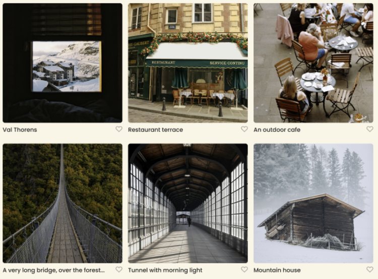

# Project 3: Spots

## Description

Spots is a responsive, interactive social media web application where users can:

- Upload new photos
- Delete their own photos
- Like and unlike other users' photos
- Edit their profile details

The layout adapts seamlessly across desktop, tablet, and mobile screens using modern CSS techniques.

## Technologies & Techniques Used

- **HTML5** for semantic markup
- **CSS3** (Flexbox & CSS Grid) for layout
- **Responsive Design** with media queries
- **BEM** methodology has been used for the folder structure as well as for HTML and CSS naming convention for class structure

## Folder Structure

```
/
├── pages/
│   └── index.css
├── images/
│   ├── avatar.jpg
│   ├── logo.svg
│   └── ...photo assets...
├── index.html
├── README.md
└── package.json
```

- **Git** for version control

## Features & Screenshots

### User Profile


### New Post Form


### Hover Effect


### Photo Gallery & Like Button



### Responsive Layout


## Live Demo

View the live project on GitHub Pages:  
https://github.com/IAM0312/se_project_spots.git
